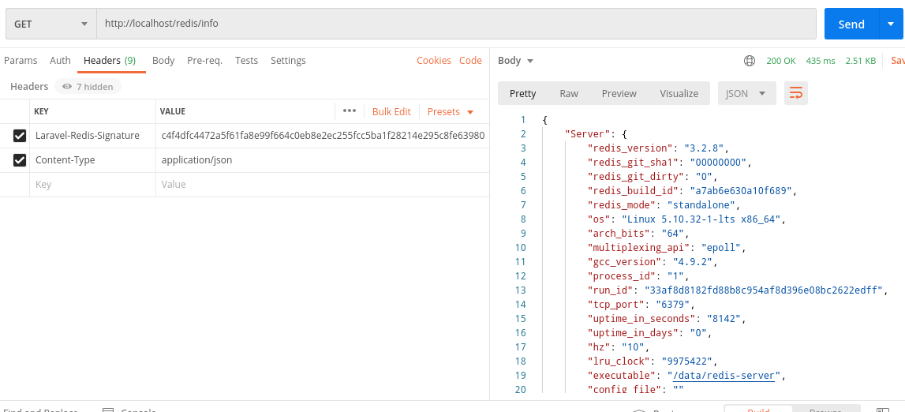

<h1 align="center">
   
  
   
</h1>

# Laravel Redis Information

<table>
  <tr>
    <td>  
      Laravel package to get information from a Redis server with json response.
    </td>
  </tr>
</table>

## How to Use

1. composer requiere

2. Run: php artisan laravel-redis:install

3. Save the printed signature property to the console.

4. Send in the header of the links the value of the signature property: 
[Laravel-Redis-Signature] => signature value

## Endpoints

1. [GET] /redis/info

2. [GET] /redis/keys

3. [GET] /redis/slow-log
